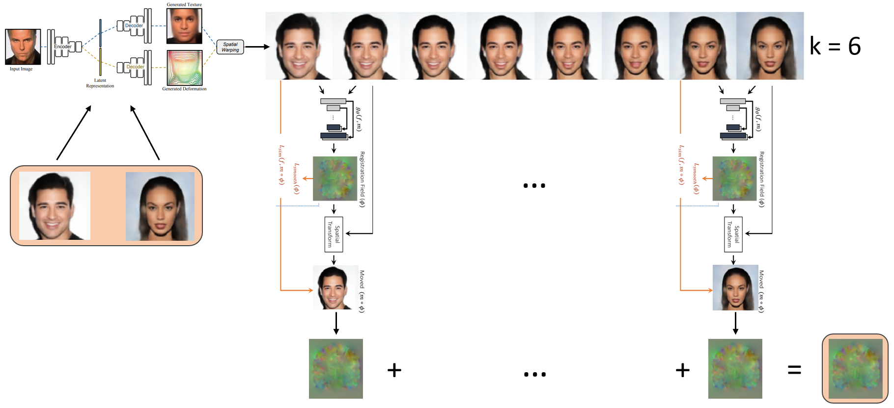

# Large, Nonlinear Image Registration

### 1. Installation using conda env

Use the following code to clone and navigate into the repo.

```
git clone https://github.com/mo12896/ImageRegistration.git
cd ImageRegistration
```

Then use the setup.sh to setup a conda environment for this project.

### 2. Idea for novel Registration Approach



First, I want to train a Deforming Autoencoder (DEA) as described by [Shu et al.](https://arxiv.org/abs/1806.06503) on
lung CT images, to not only extract shape and appearance, but also get high quality reconstructions. In a next step a
registration image-pair is fed to the DEA to produce two latent space embeddings. Between those, a simple linear
interpolation is performed, generating *k* novel embeddings. Besides the input image-pair, those embeddings are
projected back into image space, using the two decoding heads and the spatial warper of the DEA. The resulting
image-trajectory should give a valid morphing-estimate between the input image-pair. By breaking down the large,
nonlinear deformation between the images to be registered, into smaller deformations, my hope is that a SOTA
registration framework, such as Voxelmorph by [Balakrishnan et al.](https://arxiv.org/abs/1809.05231) can do the rest.
By applying *k*-1 registrations along the image-trajectory, a concatination of the resulting *k*-1 deformation fields,
leads to a final deformation field. Finally, single instance optimization - as shown
by [Teed et al.](https://arxiv.org/abs/2003.12039) - can be employed, to squeeze out the last bits from this approach.

### 3. TODOs:

- [x] Setup general training and inference tools
- [x] Train vanilla U-Net for image segmentation
- [ ] Implement Voxelmorph framework
- [ ] Implement Deforming Autoencoder (DEA)
- [ ] Add registration evaluation metrics
- [ ] Train and evaluate the novel registration framework
- [ ] Raise the whole thing to 3D
